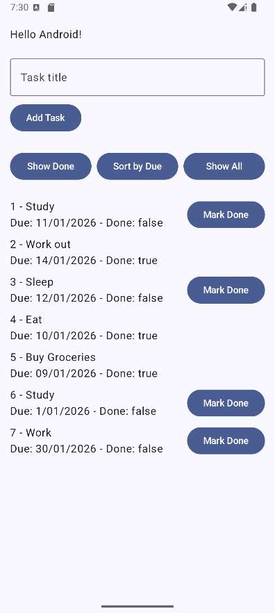

# Kotlin basics

This repository contains a simple **Android to-do list app** built with **Kotlin** and **Jetpack Compose**.  
Users can **view tasks, add new tasks, mark tasks as done, filter, and sort tasks by due date**.

---

## Features

- Display a list of tasks
- **Add new tasks** and give it a title
- **Mark tasks as done** (only undone tasks can be marked)  
- **Filter tasks** to show only completed ones (Show Done Button) 
- **Sort tasks** by due date (Sort by Due Button)
- Reset the task list to show all tasks (Show All Button)

---

## Data Model and Functions

### Data class (Task.kt)
```
data class Task(
    val id: Int,
    val title: String,
    val description: String,
    val priority: Int,
    val dueDate: String,
    val done: Boolean
)
```
- id → Unique identifier of the task
- title → Short task name
- description → Additional details
- priority → Task priority (1 = low, 2 = medium, etc.)
- dueDate → String representing the deadline
- done → Whether the task is completed

### Functions (TaskFunctions.kt):
```
fun addTask(list: List<Task>, task: Task): List<Task> { return list + task }

fun toggleDone(list: List<Task>, id: Int): List<Task> {
    return list.map { task ->
        if (task.id == id) { task.copy(done = !task.done) }
        else { task }
    }
}

fun filterByDone(list: List<Task>, done: Boolean): List<Task> {
    return list.filter { task ->
        task.done == done
    }
}

fun sortByDueDate(list: List<Task>): List<Task> {
    return list.sortedBy { task ->
        task.dueDate
    }
}
```

- addTask(list: List<Task>, task: Task): List<Task> → Adds a new task to the list
- toggleDone(list: List<Task>, id: Int): List<Task> → Toggles the done state of a task
- filterByDone(list: List<Task>, done: Boolean): List<Task> → Returns tasks that match the done state
- sortByDueDate(list: List<Task>): List<Task> → Sorts the tasks by dueDate


---

## Screenshots




---

## Dependencies

- Kotlin
- Jetpack Compose
- Material3
- AndroidX Libraries

---

## Future Improvement Ideas

- Edit task title, description, due date, and priority
- Delete task
- Sort by priority
- Change task colour by priority level, e.g. priority 1 = colour red
- Improve UI with colors, icons, and animations

---

